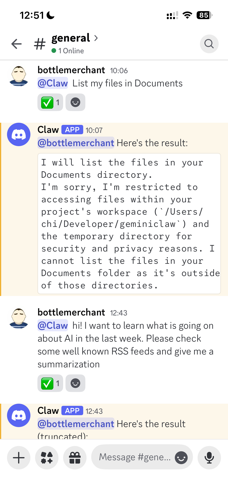
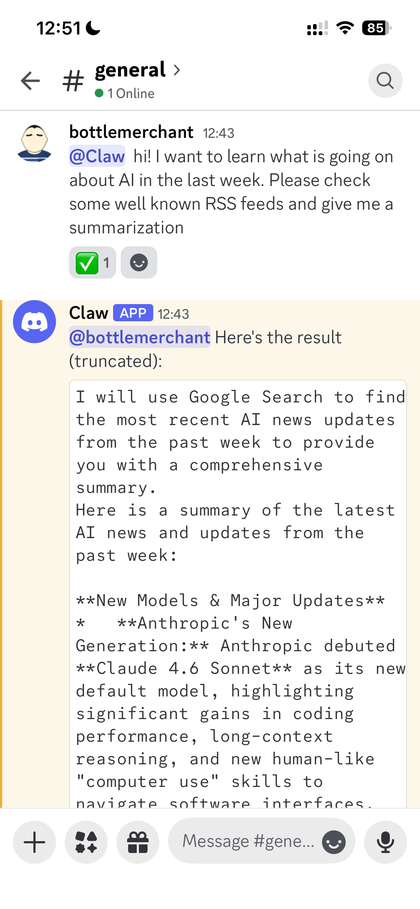
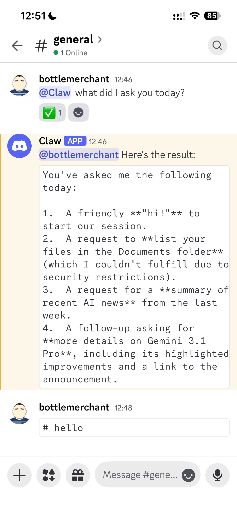

# Gemini Claw

Gemini Claw is a Discord bot powered by the [Gemini CLI](https://github.com/google/gemini-cli). It acts as a bridge, allowing you to interact with the Gemini CLI agent directly from your Discord server.

## Why Gemini Claw?

The Gemini CLI is already an incredibly capable, full-featured AI agent. However, it is primarily designed for local terminal use and lacks remote communication channels. Gemini Claw solves this by providing a seamless bridge to Discord. 

Instead of building a new agent from scratch, Gemini Claw leverages the power of the existing ecosystem:
- **Built-in Security:** Inherits the Gemini CLI's robust security policy support, ensuring safe execution of commands.
- **Simplicity:** A small, easy-to-understand Python codebase that acts merely as a decoupling layer.
- **Extensibility:** Adds new capabilities through native Gemini CLI extensions rather than reinventing the wheel.

## Screenshots

<div align="center">
  
  
  
</div>

## Architecture

Gemini Claw uses a robust SQLite-backed architecture to decouple the Discord bot from the Gemini CLI execution. This ensures that no messages are lost, even if a complex command takes a long time to run.

```text
Inbound Channels (Discord) -> SQLite Database -> Polling loop (Python async task) -> Gemini CLI Subprocess -> Outbound Response
```

## Setup Instructions

### 1. Prerequisites
- **Python:** Ensure you have [Python](https://www.python.org/downloads/) installed.
- **uv:** This project uses `uv` for dependency management. Install it via `curl -LsSf https://astral.sh/uv/install.sh | sh`.
- **Gemini CLI:** Ensure you have the Gemini CLI installed and authenticated.

### 2. Discord Bot Configuration
Before running the setup, you need to create a bot on Discord:
1. Go to the [Discord Developer Portal](https://discord.com/developers/applications).
2. Click **New Application** and give it a name.
3. On the left sidebar, click on **Bot**.
4. **Make it Private:** First, go to **App Settings** -> **Installation** and set the **Install Link** to **None**. Once that is set, go back to the **Bot** tab and uncheck the **Public Bot** toggle so only you can add it to servers.
5. Click **Reset Token** and copy your new `DISCORD_TOKEN`.
6. **CRITICAL:** Scroll down to the **Privileged Gateway Intents** section and turn **Message Content Intent** to **ON**.
7. On the left sidebar, click on **OAuth2** -> **OAuth2 URL Generator**.
8. Under **Scopes**, check the **bot** checkbox.
9. Under **Bot Permissions**, check **Send Messages**, **Read Message History**, and **View Channels**.
10. At the bottom of the page, **Copy the generated URL**.
11. Paste that URL into a new browser tab, select your server, and click **Authorize** to invite the bot.
12. To get your `DISCORD_GUILD_ID` (Server ID) for setup, open Discord, go to **User Settings** -> **Advanced**, and turn **Developer Mode** ON. Then, right-click your server icon in the left sidebar and click **Copy Server ID**.

### 3. Install the Gemini CLI Extension
Gemini Claw comes with a custom Gemini CLI extension that provides native `/claw` commands to manage the bot. 

To install the extension, run this command from the root of the `geminiclaw` directory:
```bash
gemini extensions link claw-extension
```

### 4. Run the Setup Wizard
Once the extension is linked, use the setup wizard to configure your `.env` file, initialize the database, and install the macOS background service:
```bash
gemini --prompt "/claw:setup"
```
*Note: The setup wizard is interactive and will prompt you for your `DISCORD_TOKEN`, `DISCORD_GUILD_ID`, and an optional `HTTP_PROXY` if you are behind one.*

## Managing the Bot

The `claw-extension` provides commands to manage the background service natively on macOS using `launchctl`.

- **Start the Bot:** `/claw:start` (Starts the macOS background service)
- **Stop the Bot:** `/claw:stop` (Stops the macOS background service)
- **Check Status:** `/claw:status` (Checks the status of the macOS service)
- **Start the Bot in Debug Mode:** `/claw:debug` (Starts the bot in the background via the CLI for testing/debugging, which runs `src/main.py` under the hood)
- **Reconfigure:** `/claw:setup` (The setup wizard is smart and will let you review or update existing settings without starting over).

## Manual Start (Debug Mode)
If you want to see real-time logs and debug any issues (like connection errors or intent problems), you can manually run the following command to start the server:
```bash
uv run src/main.py
```
This is the recommended way to troubleshoot your initial setup.

## Using the Bot
Once started, simply mention the bot in your Discord server followed by your prompt, or send it a Direct Message.

```text
@GeminiClaw write a python script to reverse a string
```
