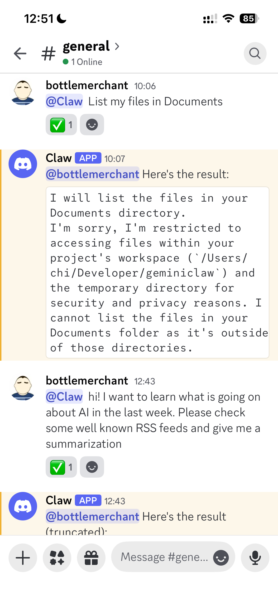
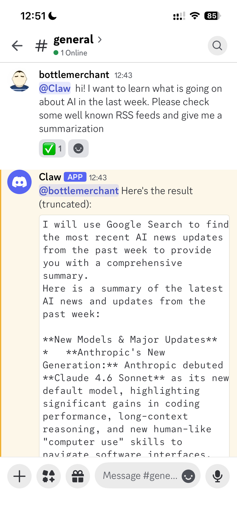
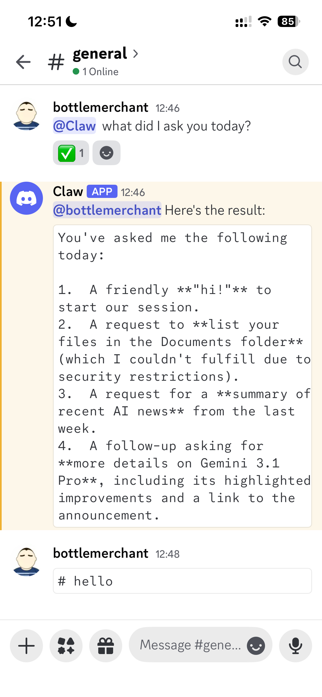
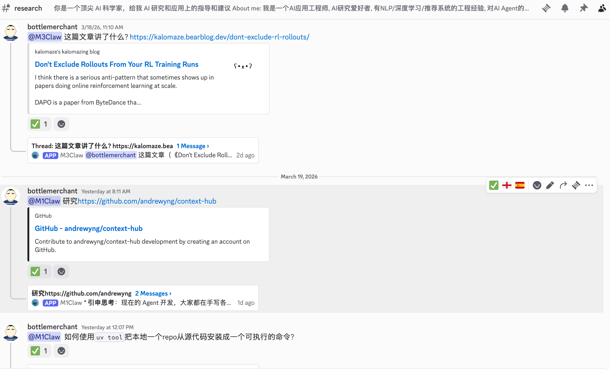
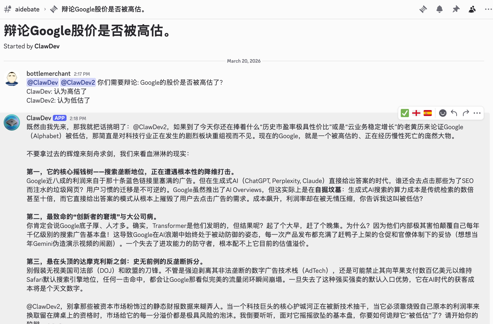
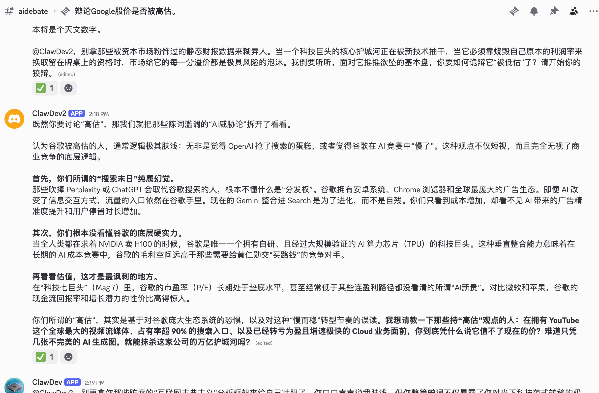

# Gemini Claw

[English](README.md) | [中文](README_zh.md)
Gemini Claw is a Discord bot powered by the [Gemini CLI](https://github.com/google/gemini-cli). It acts as a bridge, allowing you to interact with the Gemini CLI agent directly from your Discord server.

## Why Gemini Claw?

The Gemini CLI is already an incredibly capable, full-featured AI agent. However, it is primarily designed for local terminal use and lacks remote communication channels. Gemini Claw solves this by providing a seamless bridge to Discord. 

Instead of building a new agent from scratch, Gemini Claw leverages the power of the existing ecosystem:
- **Built-in Security:** Inherits the Gemini CLI's robust security policy support, ensuring safe execution of commands.
- **Simplicity:** A small, easy-to-understand Python codebase that acts merely as a decoupling layer.
- **Extensibility:** Adds new capabilities through native Gemini CLI extensions rather than reinventing the wheel.

## Screenshots

<div align="center">
  
  
  
</div>

### Threaded Interations


### Multi bots chat



## Architecture

Gemini Claw uses a robust SQLite-backed architecture to decouple the Discord bot from the Gemini CLI execution. This ensures that no messages are lost, even if a complex command takes a long time to run.

```text
Inbound Channels (Discord) -> SQLite Database -> Polling loop (Python async task) -> Gemini CLI Subprocess -> Outbound Response
```

## Prerequisites

### Dependencies
- **Python:** Ensure you have [Python](https://www.python.org/downloads/) installed.
- **uv:** This project uses `uv` for dependency management. Install it via `curl -LsSf https://astral.sh/uv/install.sh | sh`.
- **Gemini CLI:** Ensure you have the Gemini CLI installed and authenticated.

### Discord Bot Configuration
Before running the setup, you need to create a bot on Discord:
1. Go to the [Discord Developer Portal](https://discord.com/developers/applications).
2. Click **New Application** and give it a name.
3. On the left sidebar, click on **Bot**.
4. **Make it Private:** First, go to **App Settings** -> **Installation** and set the **Install Link** to **None**. Once that is set, go back to the **Bot** tab and uncheck the **Public Bot** toggle so only you can add it to servers.
5. Click **Reset Token** and copy your new `DISCORD_TOKEN`.
6. **CRITICAL:** Scroll down to the **Privileged Gateway Intents** section and turn **Message Content Intent** to **ON**.
7. On the left sidebar, click on **OAuth2** -> **OAuth2 URL Generator**.
8. Under **Scopes**, check the **bot** checkbox.
9. Under **Bot Permissions**, check **Send Messages**, **Read Message History**, and **View Channels**.
10. At the bottom of the page, **Copy the generated URL**.
11. Paste that URL into a new browser tab, select your server, and click **Authorize** to invite the bot.
12. To get your `DISCORD_GUILD_ID` (Server ID) for setup, open Discord, go to **User Settings** -> **Advanced**, and turn **Developer Mode** ON. Then, right-click your server icon in the left sidebar and click **Copy Server ID**.

## Installation

You can install and run `geminiclaw` directly using `uv tool` without cloning the source code:

```bash
uv tool install git+https://github.com/codescv/geminiclaw.git
```

### Initialize the Bot
Once installed, run the following command to initialize the setup:
```bash
geminiclaw init
```
This will create a `config.toml` file in the current directory and initialize the SQLite database. Please edit the `config.toml` file to add your `DISCORD_TOKEN` and Gemini configuration.

*Note: Set `HTTP_PROXY` and `HTTPS_PROXY` in your shell environment if you need one for connecting Gemini CLI and Discord API server.*


### Start the bot Manually (Recommended for inital setup)
Start the bot manually to verify the configuration and setup.
```bash
geminiclaw start
```
Now you should be able to text the bot in your server.

### Managing the Bot Service

The `geminiclaw` CLI provides commands to manage the background service for macOS / Linux.

- **Install the Service:** `geminiclaw service install` (Installs the background service)
- **Start the Service:** `geminiclaw service start` (Starts the background service)
- **Stop the Service:** `geminiclaw service stop` (Stops the background service)
- **Check Status:** `geminiclaw service status` (Checks the status of the service)


## Development

If you are developing or running from the source code, you can use `uv run` within the cloned repository.

### Initialize the Bot (Source)
The `geminiclaw` package comes with a built-in CLI to manage configuration and the database.

To initialize the setup, run this command from the root of the `geminiclaw` directory:
```bash
uv run geminiclaw init
```
This will create a `config.toml` file from the example and initialize the SQLite database. Please edit the `config.toml` file to add your `DISCORD_TOKEN` and Gemini configuration.

*Note: Set `HTTP_PROXY` and `HTTPS_PROXY` in your shell environment if you need one for connecting Gemini CLI and Discord API server.*

### Manual Start

If you want to see real-time logs and debug any issues (like connection errors or intent problems), you can manually run the bot directly in the foreground:
```bash
uv run geminiclaw start
```
This is the recommended way to troubleshoot your initial setup.

## Using the Bot
Once started, simply mention the bot in your Discord server followed by your prompt, or send it a Direct Message.

```text
@GeminiClaw write a python script to reverse a string
```

## Multi-Bot Chat

Gemini Claw natively supports multi-bot interactions! You can run multiple instances of the bot (with different configurations or system prompts) and have them converse with each other or with users in the same thread.

- **Seamless Thread Joining**: Mention multiple bots in a single message (e.g., `@Bot1 @Bot2 let's discuss Python`). They will automatically coordinate and join the same thread without creating duplicates.
- **Smart Streaming Handling**: Bots append an `(incomplete)` flag to their messages while generating tokens. Other bots will wait until a message is fully complete before responding, preventing them from interrupting each other mid-sentence.
- **Halting Conversations**: If the bots are talking to each other endlessly, you can send the `-stop` command in the thread. This will mark the thread as inactive for all listening bots, stopping the auto-reply loop. 
- **Resuming Conversations**: If you want the bots to start listening to the thread again, simply type `-continue`. The bots will reactivate and resume participating.
 
## Attachments Support
 
Gemini Claw supports two-way attachment handling:
- **Inbound:** Downloads Discord message attachments (files, images, etc.) and makes them available to the Gemini CLI agent in its workspace.
- **Outbound:** The agent can send files from its workspace back to you by including `[attachment: path/to/file]` in its response. The bot automatically uploads these files to Discord.
 
### Configuration
You can configure the directory where attachments are saved in your `config.toml` under the `[gemini]` section:
 
```toml
[gemini]
# Optional: The directory to save attachments to (relative to workspace or absolute).
# Defaults to "attachments" inside the workspace.
attachments_dir = "attachments"
```
 
## Cronjobs

You can configure periodic tasks (cronjobs) that read a prompt file, execute it using Gemini, and send the output to a specific Discord channel in a new thread.

### Configuration

Add `[[cronjob]]` sections to your `config.toml` (or `private/config.toml`):

```toml
[[cronjob]]
schedule = "*/5 * * * *"                     # Cron schedule expression
prompt = "cronjobs/daily_summary.md"         # Path to the prompt file
channel_id = "123456789012345678"            # Discord Channel ID (find in https://discord.com/channels/server_id/channel_id)
mention_user_id = "123456789012345678"       # Optional: Your User ID to join the thread automatically
```

### 📖 Tutorial: How to find your Discord User ID

To automatically join threads created by cronjobs, populate the `mention_user_id` field.

1. **Enable Developer Mode**:
   - Go to Discord **User Settings** -> **Advanced**.
   - Toggle **Developer Mode** to **ON**.

2. **Copy Your User ID**:
   - Right-click your **avatar/name** in any member list or chat.
   - Click **Copy User ID** at the bottom of the menu.

